---
layout:
  - page
title:  scikit-learn初级
date: 2020-05-10 16:16:53
tags: 
   - [python]
   - [数据分析]
---
 
<!--more-->

#  第一章 scikit-learn初级

课程介绍：本阶段课程学习人工智能机器学习入门算法以及opencv人脸识别基础。机器学习方向主要通过Scikit-learn模块来学习。人脸识别基础主要通过opencv来实现与了解。

# scikit-learn

英文官网：https://scikit-learn.org/stable/index.html

中文官网：https://sklearn.apachecn.org/#/

官网：https://scikit-learn.org/stable/index.html

## 1.1 Scikit-Learn简介

Scikit-Learn（简称Sklearn）是Python的第三方模块，它是机器学习领域中知名的Python模块之一，它对常用的机器学习算法进行了封装，包括回归（Regression）、降维（Dimensionality Reduction）、分类（Classification）和聚类（Clustering）四大机器学习算法。Scikit-Learn具有以下特点。　

简单高效的数据挖掘和数据分析工具。　

让每个人能够在复杂环境中重复使用。　

Scikit-Learn是Scipy模块的扩展，是建立在NumPy和Matplotlib模块的基础上的。利用这几大模块的优势，可以大大提高机器学习的效率。　

开源，采用BSD协议，可用于商业。

## 1.2安装Scikit-Learn

Scikit-Learn安装要求如下。　

Python版本：高于2.7。　

NumPy版本：高于1.10.2。　

SciPy版本：高于0.13.3。

如果已经安装NumPy和Scipy，那么安装Scikit-Learn最简单的方法是使用pip工具安装。命令如下：

pip install -U scikit-learn
或者使用conda，命令如下：

conda install scikit-learn
还可以在PyCharm开发环境中安装。运行PyCharm，选择File→Settings命令，打开Settings对话框，选择Project Interpreter选项，然后单击+（添加）按钮，打开Available Packages对话框，在搜索文本框中输入需要添加的模块名称，例如scikit-learn，然后在列表中选择需要安装的模块，如图10.1所示。单击Install Package按钮即可实现Scikit-Learn模块的安装。

<!-- 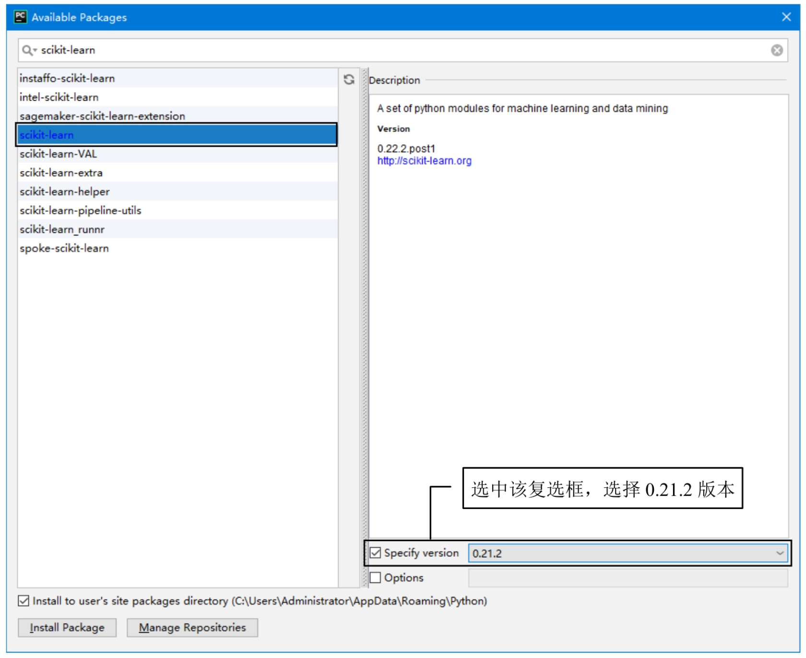 -->
<!--  -->

​                                                          图1.1　安装Scikit-Learn
这里需要注意：尽量选择安装0.21.2版本，否则运行程序可能会出现因为模块版本不适合而导致程序出现错误提示——“找不到指定的模块”。

查看是否安装成功 pip list

或者

import sklearn

sklearn.____version____

## 1.3  概念

scikit-learn库主要功能分六大部分：分类，回归，聚类，降维，模型选择，数据预处理。

### 1.3.1 监督学习

**监督学习（supervised learning）**的任务是学习一个模型，使模型能够对任意给定的输入，对其相应的输出做出一个好的预测。

即：利用训练数据集学习一个模型，再用模型对测试样本集进行预测。

通俗理解：每个数据点都被标记或关联一个类别或者分值。

例（类别）：输入一张图片，判断该图片中的动物是猫还是狗；

例（分值）：通过大量数据预测一辆二手车的出售价格；

监督学习的目的就是学习大量的样本（称作训练数据），从而对未来的数据点做出预测（称作测试数据）。

分类和回归

从根本上来说，分类是预测一个标签，回归是预测一个数量。

- 分类是给一个样本预测离散型类别标签的问题。

- 回归是给一个样本预测连续输出量的问题。

  

### 1.3.2 非监督学习

**非监督学习（unsupervised learning）**为直接对数据进行建模。没有给定事先标记过的训练范例，所用的数据没有属性或标签这一概念。事先不知道输入数据对应的输出结果是什么。

自动对输入的资料进行分类或分群，以寻找数据的模型和规律。

例：聚类

### 1.3.3 强化学习

**强化学习（Reinforcement Learning）**是机器学习中的一个领域，强调如何基于环境而行动，以取得最大化的预期利益。其灵感来源于心理学中的行为主义理论，即有机体如何在环境给予的奖励或惩罚的刺激下，逐步形成对刺激的预期，产生能获得最大利益的习惯性行为。

有监督学习、无监督学习、强化学习具有不同的特点：

- 有监督学习是有一个label（标记）的，这个label告诉算法什么样的输入对应着什么样的输出，常见的算法是分类、回归等；
- 无监督学习则是没有label（标记），常见的算法是聚类；
- 强化学习强调如何基于环境而行动，以取得最大化的预期利益。

## 1.4  数据预处理

在真实的世界中，经常需要处理大量的原始数据，这些原始数据是机器学习算法无法理解的，为了让机器学习算法理解原始数据，需要对数据进行预处理。

### 1.4.1 准备工作

python进行数据预处理，需要加载两个必要的程序包。

import numpy as np
from sklearn import preprocessing

data = np.array([[ 3, -1.5,  2, -5.4],
                 [ 0,  4,  -0.3, 2.1],
                 [ 1,  3.3, -1.9, -4.3]])

### 1.4.2 详细步骤

#### 1.均值移除（Mean removal）

**通常我们会把每个特征的平均值移除，以保证特征均值为0(即标准化处理)**。这样做可以消除特征彼此之间的偏差（bias)。

sklearn.preprocessing.scale()函数
官方文档

sklearn.preprocessing.scale(X, axis=0, with_mean=True, with_std=True, copy=True)
沿着某个轴标准化数据集，以均值为中心，以分量为单位方差。

参数	数据类型	意义
X	{array-like, sparse matrix}	以此数据为中心缩放
axis	int (0 by default)	沿着计算均值和标准差的轴。如果是0，独立的标准化每个特征，如果是1则标准化每个样本（即行）
with_mean	boolean, True by default	如果是True，缩放之前先中心化数据
with_std	boolean, True by default	如果是True，以单位方差法缩放数据（或者等价地，单位标准差）
copy	boolean, optional, default True	False：原地执行行标准化并避免复制（如果输入已经是一个numpy数组或者scipy.sparse CSC矩阵以及axis是1）

[x1,x2,x3,x4]

var=((x1-mean)^2+(x2-mean)^2+(x3-mean)^2+(x4-mean)^2)/4

std=sqrt(var)

#mean removal

data = np.array([[ 3, -1.5,  2, -5.4],
                              [ 0,  4,  -0.3, 2.1],
                              [ 1,  3.3, -1.9, -4.3]])

data_standardized = preprocessing.scale(data)

(data-data.mean(axis=0))/data.std(axis=0)

print "\nMean =", data_standardized.mean(axis=0)
print "Std deviation =", data_standardized.std(axis=0)

#### 2.范围缩放（Scaling)

数据点中每个特征的数值范围可能变化很大，以此，有时将特征的数值范围缩放到合理的大小是非常重要的。

官网：https://scikit-learn.org/stable/modules/generated/sklearn.preprocessing.MinMaxScaler.html#sklearn.preprocessing.MinMaxScaler

方法介绍：

fit(): Method calculates the parameters μ and σ and saves them as internal objects.
解释：简单来说，就是求得训练集X的均值，方差，最大值，最小值,这些训练集X固有的属性。

transform(): Method using these calculated parameters apply the transformation to a particular dataset.
解释：在fit的基础上，进行标准化，降维，归一化等操作（看具体用的是哪个工具，如PCA，StandardScaler等）。

fit_transform(): joins the fit() and transform() method for transformation of dataset.
解释：fit_transform是fit和transform的组合，既包括了训练又包含了转换。
transform()和fit_transform()二者的功能都是对数据进行某种统一处理（比如标准化~N(0,1)，将数据缩放(映射)到某个固定区间，归一化，正则化等）

#min max scaling

data_scaler = preprocessing.MinMaxScaler(feature_range=(0, 1))
data_scaled = data_scaler.fit_transform(data)
print("\nMin max scaled data:\n", data_scaled)

#### 3.归一化（normalization)

数据归一化用于需要对特征向量的值进行调整时，以保证每个特征向量的值都缩放到相同的数值范围。机器学习中最常用的归一化形式就是将特征向量调整为L1范数。

L1归一化：将每个数据除以L1范数(所有数据的绝对值之和)

##normalization

data_normalized = preprocessing.normalize(data, norm='l1')
print ("\nL1 normalized data:\n", data_normalized)

这个方法经常用于确保数据点没有因为特征的基本性质而产生较大的差异，即确保数据处于同一数量级，提高不同特征数据的可比性。

##### L0，L1范数和L2范数
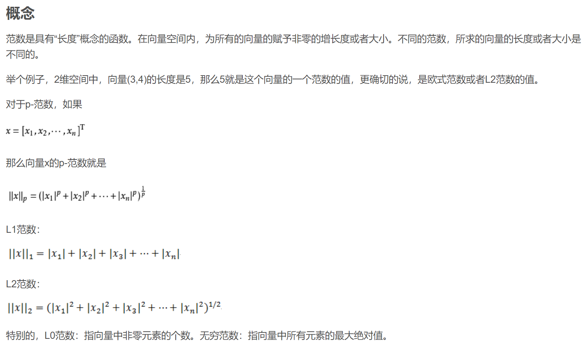

##### L1和L2范数在机器学习中的用途

https://zhuanlan.zhihu.com/p/28023308

注意：虽然在数学概念上存在Lp范数，但是在机器学习函数中只支持L1和L2范数。

例1:使用numpy生成一组随机数，并使用归一化进行预处理

#### 4.二值化（Binarization）

二值化用于将数值特征向量转换为布尔类型的向量。

#binarization

data_binarized = preprocessing.Binarizer(threshold=1.4).transform(data)

###

data_binarizer=preprocessing.Binarizer(threshold=1.4)

data_binarized =data_binarizer.transform(data)

print("\nBinarized data:\n", data_binarized) 

#### 5.独热编码（one-hot encoding)

通常，需要处理的数值都是稀疏的，散乱的分布在空间中，然而我们并不需要存储这些大数值，这时就需要使用独热编码。可以把独热编码看做一种收紧特征向量的工具。它把特征向量的每个特征与特征的非重复总数相对应，通过one-of-k的形式对每个特征进行编码。

#one hot encoding

encoder = preprocessing.OneHotEncoder()
encoder.fit([

[0, 2, 1, 12], 

[1, 3, 5, 3], 

[2, 3, 2, 12],

 [1, 2, 4, 3]])
encoded_vector = encoder.transform([[2, 3, 5, 3]]).toarray()
print ("\nEncoded vector:\n", encoded_vector)

#第一个特征（即为第一列）为[0,1,2,1],其中三类特征值[0,1,2],因此One-Hot Code可将[0,1,2]表示为:[100,010,001]
#第一个特征有三种值：采用三个编码：[100,010,001]

#同理第二个特征列可将两类特征值[2,3]表示为[10,01]

#第三个特征将4类特征值[1,2,4,5]表示为[1000,0100,0010,0001]

#第四个特征将2类特征值[3,12]表示为[10,01]

### 1.4.3 标记编码

在监督学习中，经常需要处理各种各样的标记。这些标记可能是数字，也可能是单词。如果标记是数字，那么算法可以直接使用它们，但是许多情况下，标记都需要以人们可理解的形式存在。因此，人们通常会用单词标记训练数据集。标记编码就是把单词标记转换成数值形式，让算法懂得如何操作标记。

import numpy as np
from sklearn import preprocessing

label_encoder = preprocessing.LabelEncoder()
input_classes = ['audi', 'ford', 'audi', 'toyota', 'ford', 'bmw']
label_encoder.fit(input_classes)

#print classes

print "\nClass mapping:"
for i, item in enumerate(label_encoder.classes_):
    print item, '-->', i

#transform a set of classes

labels = ['toyota', 'ford', 'audi']
encoded_labels = label_encoder.transform(labels)
print "\nLabels =", labels 
print "Encoded labels =", list(encoded_labels)

#inverse transform

encoded_labels = [2, 1, 0, 3, 1]
decoded_labels = label_encoder.inverse_transform(encoded_labels)
print "\nEncoded labels =", encoded_labels
print "Decoded labels =", list(decoded_labels)

## 1.5 线性回归模型

Scikit-Learn已经为我们设计好了线性模型（sklearn.linear_model），在程序中直接调用即可，无须编写过多代码就可以轻松实现线性回归分析。首先了解一下线性回归析。
线性回归是利用数理统计中的回归分析来确定两种或两种以上变量间相互依赖的定量关系的一种统计分析与预测方法，运用十分广泛。

在线性回归分析中，只包括一个自变量和一个因变量，且二者的关系可用一条直线近似表示，这种回归分析称为**一元线性回归分析**；如果线性回归分析中包括两个或两个以上的自变量，且因变量和自变量之间是线性关系，则称为**多元线性回归分析**。

在Python中，无须理会烦琐的线性回归求解数学过程，直接使用Scikit-Learn的linear_model模块就可以实现线性回归分析。

linear_model模块提供了很多线性模型，包括最小二乘法回归、岭回归、**Lasso、贝叶斯回归**等。本节主要介绍最小二乘法回归和岭回归。

5x1+6x2=10

x1-x2=5

首先导入linear_model模块，程序代码如下：

from sklearn import linear_model
导入linear_model模块后，在程序中就可以使用相关函数实现线性回归分析。

### 1.5.1　最小二乘法回归

线性回归是数据挖掘中的基础算法之一，线性回归的思想其实就是解一组方程，得到回归系数，不过在出现误差项之后，方程的解法就存在了改变，一般使用最小二乘法进行计算，所谓“二乘”就是平方的意思，最小二乘法也称最小平方和，其目的是通过最小化误差的平方和，使得预测值与真值无限接近。

最小二乘原理补充：

y=wx+b

(x1,y1) (x2,y2)....(xm,ym)

wx1+b    y1

Loss

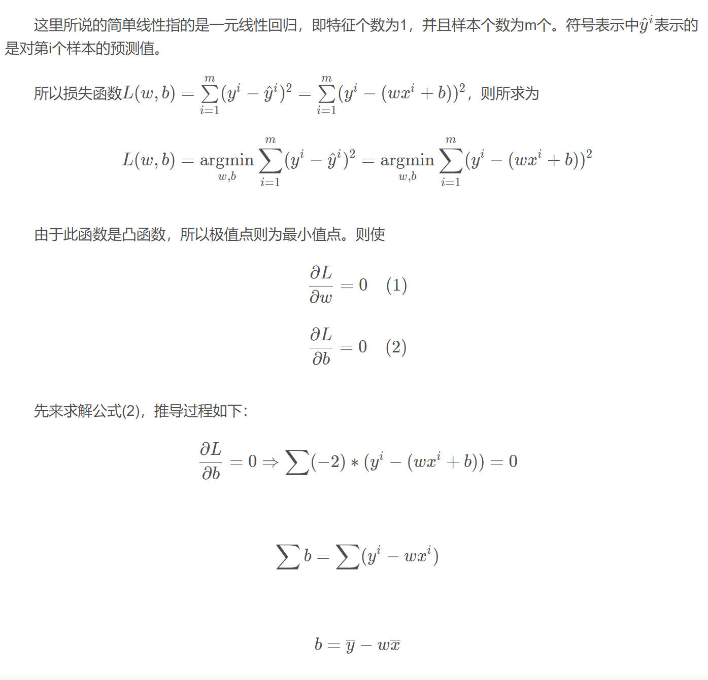

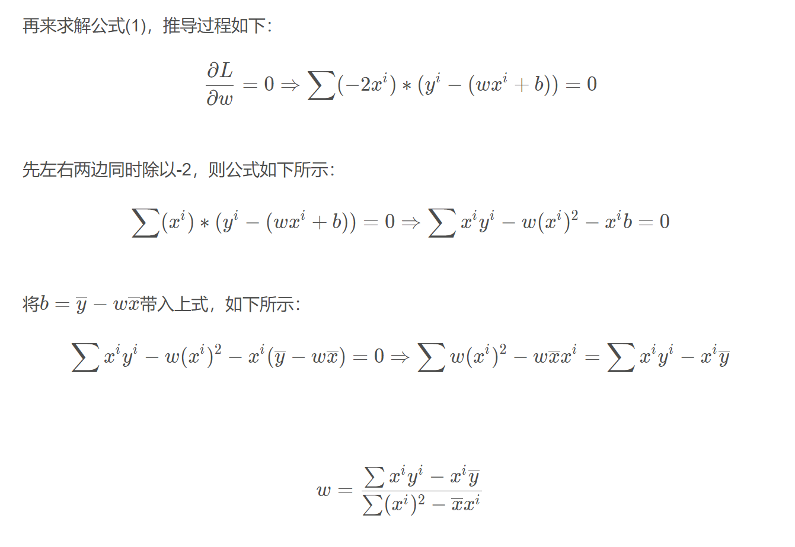

linear_model模块的LinearRegression()函数用于实现最小二乘法回归。LinearRegression()函数拟合一个带有回归系数的线性模型，使得真实数据和预测数据（估计值）之间的残差平方和最小，与真实数据无限接近。LinearRegression()函数语法如下：

linear_model.LinearRegression(fit_intercept=True,normalize=False,copy_X=True,n_jobs=NoNone)
参数说明：　

fit_intercept：布尔型值，是否需要计算截距，默认值为True。　

normalize：布尔型值，是否需要标准化，默认值为False，与参数fit_intercept有关。当fit_intercept参数值为False时，将忽略该参数；当fit_intercept参数值为True时，则回归前对回归量X进行归一化处理，取均值相减，再除以L2范数（L2范数是指向量各元素的平方和然后开方）。　

copy_X：布尔型值，选择是否复制X数据，默认值为True，如果值为False，则覆盖X数据。　

n_jobs：整型，代表CPU工作效率的核数，默认值为1，-1表示跟CPU核数一致。

主要属性：　

coef_：数组或形状，表示线性回归分析的回归系数。　

intercept_：数组，表示截距。
主要方法：　

fit(X,y,sample_weight=None)：拟合线性模型。　

predict(X)：使用线性模型返回预测数据。　

score(X,y,sample_weight=None)：返回预测的确定系数R^2。
LinearRegression()函数调用fit()方法来拟合数组X、y，并且将线性模型的回归系数存储在其成员变量coef_属性中。

【示例01】　智能预测房价。（示例位置：资源包\MR\Code\10\01）
智能预测房价，假设某地房屋面积和价格关系如图10.2所示。下面使用LinearRegression()函数预测面积为170平方米的房屋的单价。

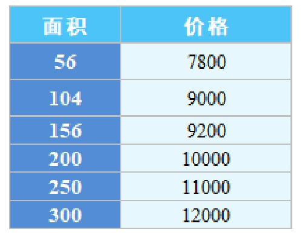

​                                                                                                图10.2　房屋价格表

x=[56,104,156,200,250,300]

x=[[56],[104],[156],[200],[250],[300]]

y=[7800,9000,9200,10000,11000,12000]    

clf.predict([[500]])    

​                                                                        

程序代码如下：

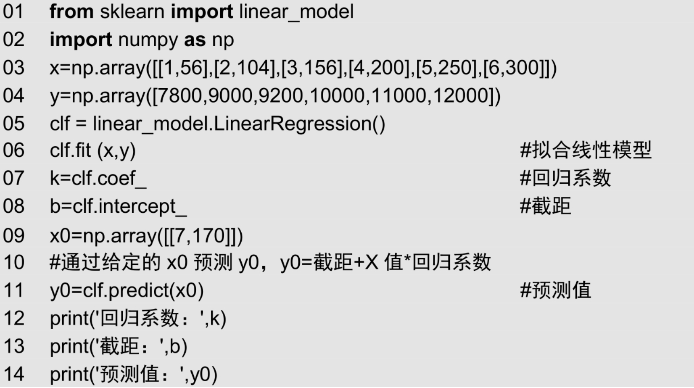

运行程序，输出结果如下：

回归系数：[1853.37423313  -21.7791411 ]

截距：7215.950920245397

预测值：[16487.11656442]

### 1.5.2　岭回归

线性回归的主要问题的对异常值敏感。在真实的世界的数据收集过程中，经常会遇到错误的度量结果。而线性回归使用的普通最小二乘法，其目标是使平方误差最小化。这时，由于异常误差的绝对值很大，因此会引起问题，从而破坏整个模型。为了避免整个问题，我们引入了**正则化项的系数**作为阈值来消除异常值的影响。这个方法称为岭回归。

岭回归是在最小二乘法回归基础上，加入了对表示回归系数的L2范数约束。岭回归是缩减法的一种，相当于对回归系数的大小施加了限制。

岭回归详解：

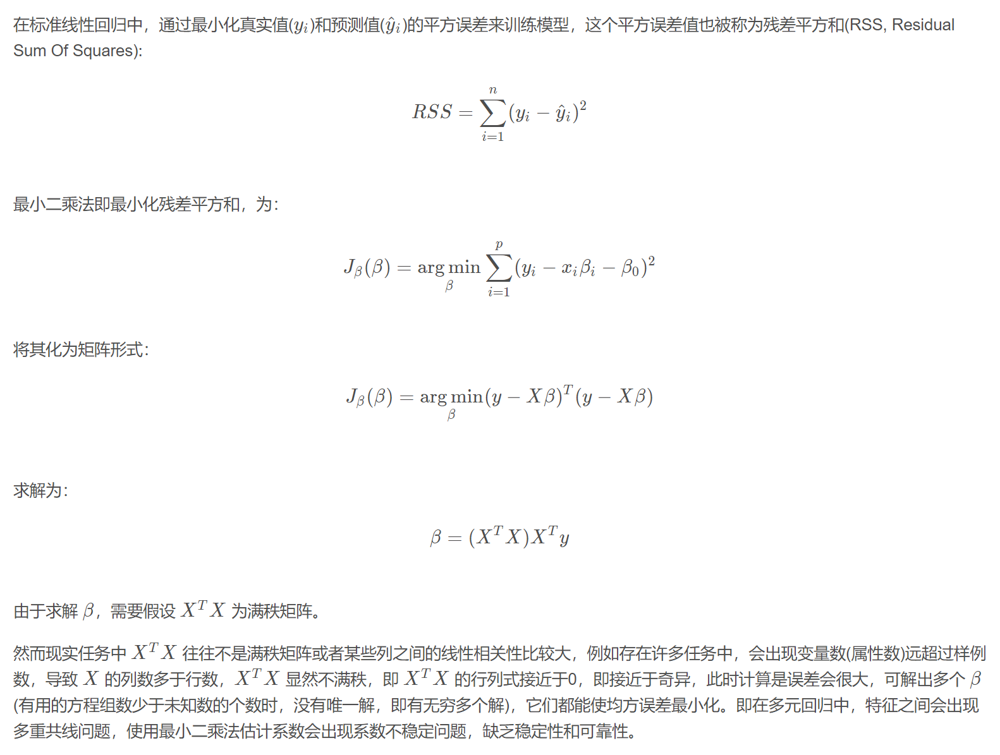

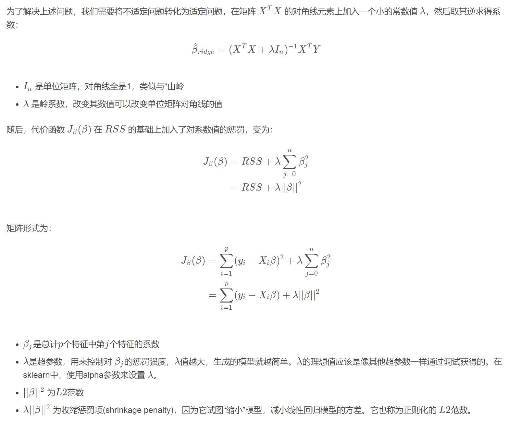

岭回归的特点：
岭回归是一种改良的最小二乘估计法，通过放弃最小二乘法的无偏性，以损失部分信息、降低精度为代价获得回归系数，它是更为符合实际、更可靠的回归方法，对存在离群点的数据的拟合要强于最小二乘法。

不同与线性回归的无偏估计，岭回归的优势在于它的无偏估计，更趋向于将部分系数向0收缩。因此，它可以缓解多重共线问题，以及过拟合问题。但是由于岭回归中并没有将系数收缩到0，而是使得系数整体变小，因此，某些时候模型的解释性会大大降低，也无法从根本上解决多重共线问题。

岭回归主要使用linear_model模块的Ridge()函数实现。语法如下：

linear_model.Ridge(alpha=1.0,fit_intercept=True,normalize=False,copy_X=True,max_iter=None,tol=0.001,solver=
'auto',random_state=None)
参数说明：　

alpha：权重。　

fit_intercept：布尔型值，是否需要计算截距，默认值为True。　

normalize：输入的样本特征归一化，默认值为False。　

copy_X：复制或者重写。　

max_iter：最大迭代次数。

tol：浮点型，控制求解的精度。　

solver：求解器，其值包括auto、svd、cholesky、sparse_cg和lsqr，默认值为auto。

主要属性：

coef_：数组或形状，表示线性回归分析的回归系数。

主要方法：　

fit(X,y)：拟合线性模型。　

_predict(X)：使用线性模型返回预测数据。
Ridg()函数使用fit()方法将线性模型的回归系数存储在其成员变量coef_属性中。

【示例02】　使用岭回归函数实现智能预测房价。（示例位置：资源包\MR\Code\10\02）
使用岭回归函数Ridg()实现智能预测房价，程序代码如下：

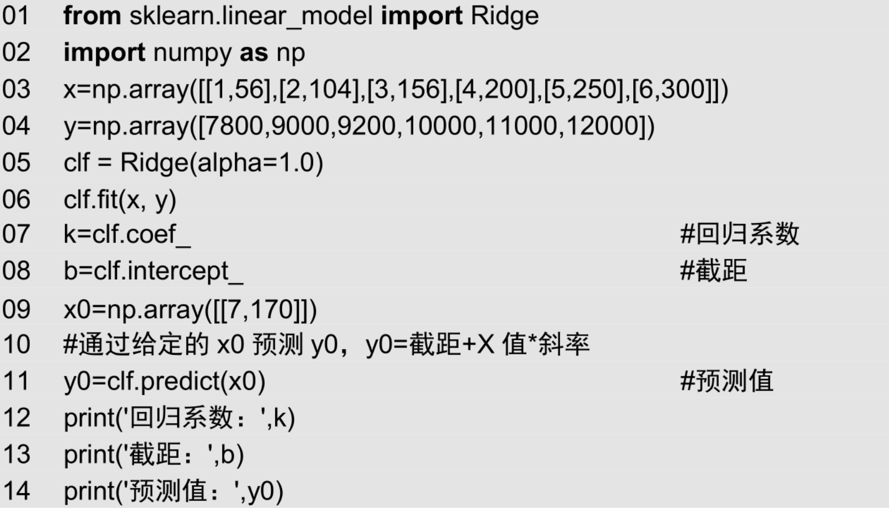

运行程序，输出结果如下：

回归系数：[10.00932795 16.11613094]截距：6935.001421210872预测值：[9744.80897725]

y=3x+8

## 1.6 支持向量机

支持向量机（SVM）可用于监督学习算法，主要包括分类、回归和异常检测。支持向量分类的方法可以被扩展用作解决回归问题，这个方法被称作支持向量回归。

本节介绍支持向量回归函数——LinearSVR()函数。LinearSVR()类是一个支持向量回归的函数，支持向量回归不仅适用于线性模型，还可以用于对数据和特征之间的非线性关系的研究。避免多重共线性问题，从而提高泛化性能，解决高维问题，语法如下：

sklearn.svm.LinearSVR(epsilon = 0.0, tol = 0.0001, C = 1.0, loss ='epsilon_insensitive', fit_intercept = True,
intercept_scaling = 1.0, dual = True, verbose = 0, random_state = None, max_iter = 1000)
参数说明：　

epsilon：float类型值，默认值为0.0。　

tol：float类型值，终止迭代的标准值，默认值为0.0001。　

C：float类型值，罚项参数，该参数越大，使用的正则化越少，默认值为1.0。　

loss：string类型值，损失函数，该参数有以下两种选项。　

​		epsilon_insensitive：默认值，不敏感损失（标准SVR）是L1损失。　

​		squared_epsilon_insensitive：平方不敏感损失是L2损失。　

fit_intercept：boolean类型值，是否计算此模型的截距。如果设置值为False，则不会在计算中使用截距（即数据预计已经居中）。默认值为True。　

intercept_scaling：float类型值，当fit_intercept为True时，实例向量x变为[x,self.intercept_scaling]。此时相当于添加了一个特征，该特征将对所有实例都是常数值。　

dual：boolean类型值，选择算法以解决对偶或原始优化问题。当设置值为True时，可解决对偶问题；当设置值为False时，可解决原始问题。默认值为True。　

verbose：int类型值，是否开启verbose输出，默认值为0。

random_state：int类型值，随机数生成器的种子，用于在清洗数据时使用。默认值为None。　

max_iter：int类型值，要运行的最大迭代次数。默认值为1000。

两个主要的属性：　

coef_：赋予特征的权重，返回array数据类型。

intercept_：决策函数中的常量，返回array数据类型。

【示例03】　波士顿房价预测。（示例位置：资源包\MR\Code\10\03）

变量名	说明
CRIM	城镇人口犯罪率
ZN	超过25000平方英尺的住宅用地所占比例
INDUS	城镇非零售业务地区的比例
CHAS	查尔斯河虚拟变量(如果土地在河边=1；否则是0)
NOX	一氧化氮浓度(每1000万份)
RM	平均每居民房数
AGE	在1940年之前建成的所有者占用单位的比例
DIS	与五个波士顿就业中心的加权距离
RAD	辐射状公路的可达性指数
TAX	每10,000美元的全额物业税率
RTRATIO	城镇师生比例
B	1000(Bk-0.63)^2其中Bk是城镇黑人的比例
LSTAT	人口中地位较低人群的百分数
MEDV	(目标变量/类别属性)以1000美元计算的自有住房的中位数

通过Scikit-Learn自带的数据集“波士顿房价”，实现房价预测，程序代码如下：

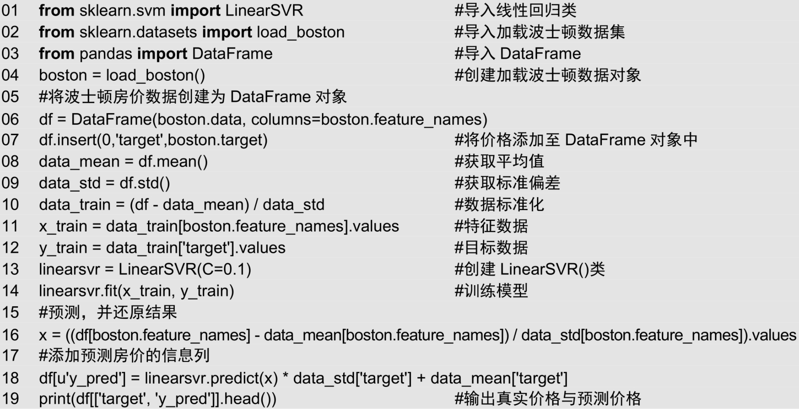

运行程序，输出结果如下：

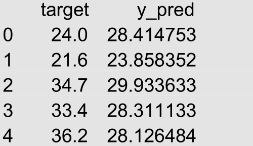

## 1.7 决策树回归器

决策树是一个树状模型，每个节点都做出一个决策，从而影响最终结果。叶子节点表示输出数值，分支表示根据输入特征做出的中间决策。AdaBoost算法是指自适应增强算法，这是一种利用其它系统增强模型准确性的技术。这种技术是将不同版本的算法结果进行组合，用加权汇总的方法获得最终结果，被称为弱学习器。Adaboost算法在每个阶段获取的信息都会反馈到模型中，这样学习器就可以在后一阶段重点训练难以分类的样本。这种学习方式可以增强系统的准确性。

https://www.cnblogs.com/liuwu265/p/4692347.html

例1:波士顿房价预估

import numpy as np
from sklearn.ensemble import RandomForestRegressor, AdaBoostRegressor
from sklearn.tree import DecisionTreeRegressor
from sklearn import datasets
from sklearn.metrics import mean_squared_error, explained_variance_score
from sklearn.utils import shuffle
import matplotlib.pyplot as plt

housing_data = datasets.load_boston() 

#Shuffle the data

X, y = shuffle(housing_data.data, housing_data.target, random_state=7)

#Split the data 80/20 (80% for training, 20% for testing)

num_training = int(0.8 * len(X))
X_train, y_train = X[:num_training], y[:num_training]
X_test, y_test = X[num_training:], y[num_training:]

#决策树模型

dt_regressor = DecisionTreeRegressor(max_depth=4)
dt_regressor.fit(X_train, y_train)

#AdaBoost决策树

ab_regressor = AdaBoostRegressor(DecisionTreeRegressor(max_depth=4), n_estimators=400, random_state=7)
ab_regressor.fit(X_train, y_train)

#Evaluate performance of Decision Tree regressor

y_pred_dt = dt_regressor.predict(X_test)
mse = mean_squared_error(y_test, y_pred_dt)
evs = explained_variance_score(y_test, y_pred_dt) 
print("\n#### Decision Tree performance ####") 
print("Mean squared error =", round(mse, 2))
print("Explained variance score =", round(evs, 2)) 

#Evaluate performance of AdaBoost

y_pred_ab = ab_regressor.predict(X_test)
mse = mean_squared_error(y_test, y_pred_ab)
evs = explained_variance_score(y_test, y_pred_ab) 
print("\n#### AdaBoost performance ####") 
print("Mean squared error =", round(mse, 2)) 
print("Explained variance score =", round(evs, 2)) 

## 1.7　聚类

### 1.7.1　什么是聚类

聚类类似于分类，不同的是聚类所要求划分的类是未知的，也就是说不知道应该属于哪类，而是通过一定的算法自动分类。在实际应用中，聚类是一个将在某些方面相似的据进行分类组织的过程（简单地说就是将相似数据聚在一起），其示意图如图10.3和图10.4所示。

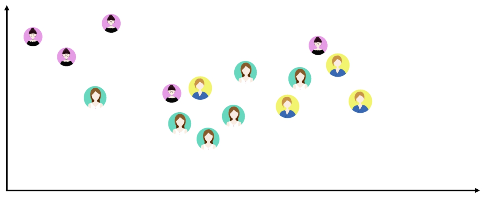

​                                                                                                         图10.3　聚类前

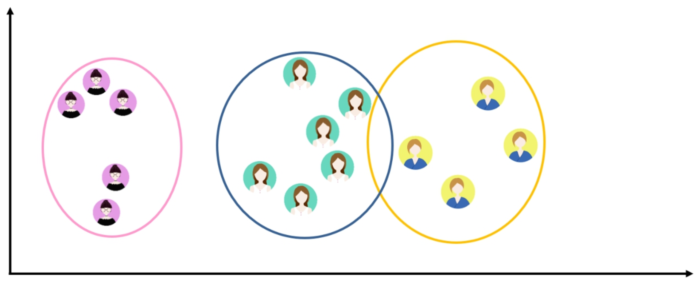

​                                                                                                   图10.4　聚类后
聚类主要应用领域如下。　

商业：聚类分析被用来发现不同的客户群，并且通过购买模式刻画不同客户群的特征。　

生物：聚类分析被用来对动植物分类和对基因进行分类，获取对种群固有结构的认识。　

保险行业：聚类分析通过一个高的平均消费来鉴定汽车保险单持有者的分组，同时根据住宅类型、价值和地理位置来判断一个城市的房产分组。　

互联网：聚类分析被用来在网上进行文档归类。　

电子商务：聚类分析在电子商务网站数据挖掘中也是很重要的一个方面，通过分组聚类出具有相似浏览行为的客户，并分析客户的共同特征，可以更好地帮助电商了解自己的客户，向客户提供更合适的服务。

### 1.7.2　聚类算法

k-means算法是一种聚类算法，它是一种无监督学习算法，目的是将相似的对象归到同一个簇中。簇内的对象越相似，聚类的效果就越好。
传统的聚类算法包括划分方法、层次方法、基于密度方法、基于网格方法和基于模型方法。

本节主要介绍k-means聚类算法，它是划分方法中较典型的一种，也可以称为k均聚类算法。下面介绍什么是k均值聚类以及相关算法。

1．k-means聚类

k-means聚类也称为k均值聚类，是著名的划分聚类的算法，由于简洁和高效使得它成为所有聚类算法中应用最为广泛的一种。k均值聚类是给定一个数据点集合和需要的聚类数目k，k由用户指定，k均值算法根据某个距离函数反复把数据分入k个聚类中。

2．算法
随机选取k个点作为初始质心（质心即簇中所有点的中心），然后将数据集中的每个点分配到一个簇中，具体来讲，为每个点找距其最近的质心，并将其分配给该质心所对应的簇。这一步完成之后，将每个簇的质心更新为该簇所有点的平均值。这个过程将不断重复直到满足某个终止条件。终止条件可以是以下任何一个。　

没有（或最小数目）对象被重新分配给不同的聚类。　

没有（或最小数目）聚类中心再发生变化。　

误差平方和局部最小。

伪代码：

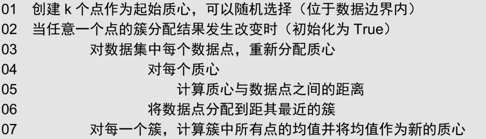

通过以上介绍相信读者对k-means聚类算法已经有了初步的认识，而在Python中应用该算法无须手动编写代码，因为Python第三方模块Scikit-Learn已经帮我们写好了，在性能和稳定性上比自己写的好得多，只需在程序中调用即可，没必要自己造轮子。

### 1.7.3　聚类模块

Scikit-Learn的cluster模块用于聚类分析，该模块提供了很多聚类算法，下面主要介绍KMeans方法，该方法通过k-means聚类算法实现聚类分析。
首先导入sklearn.cluster模块的KMeans方法，程序代码如下：

from sklearn.cluster import KMeans
接下来，在程序中就可以使用KMeans()方法了。KMeans()方法的语法如下：

KMeans(n_clusters=8,init='k-means++',n_init=10,max_iter=300,tol=1e-4,precompute_distances='auto',verbose=
0,random_state=None,copy_x=True,n_jobs=None,algorithm='auto')
参数说明：　

n_clusters：整型，默认值为8，是生成的聚类数，即产生的质心（centroid）数。　

init：参数值为k-means++、random或者传递一个数组向量。默认值为k-means++。　

k-means++：用一种特殊的方法选定初始质心从而加速迭代过程的收敛。　

random：随机从训练数据中选取初始质心。如果传递数组类型，则应该是shape(n_clusters,n_features)的形式，并给出初始质心。　

n_init：整型，默认值为10，用不同的质心初始化值运行算法的次数。　

max_iter：整型，默认值为300，每执行一次k-means算法的最大迭代次数。　

tol：浮点型，默认值1e-4（科学技术法，即1乘以10的-4次方），控制求解的精度。　

precompute_distances：参数值为auto、True或者False。用于预先计算距离，计算速度更快但占用更多内存。　

​			auto：如果样本数乘以聚类数大于12e6（科学技术法，即12乘以10的6次方），则不预先计算距离。

​			True：总是预先计算距离。　

​			False：永远不预先计算距离。　

verbose：整型，默认值为0，冗长的模式。　

random_state：整型或随机数组类型。用于初始化质心的生成器（generator）。如果值为一个整数，则确定一个种子（seed）。默认值为NumPy的随机数生成器。　

copy_x：布尔型，默认值为True。如果值为True，则原始数据不会被改变；如果值为False，则会直接在原始数据上做修改，并在函数返回值时将其还原。但是在计算过程中由于有对数据均值的加减运算，所以数据返回后，原始数据同计算前数据可能会有细小差别。　

n_jobs：整型，指定计算所用的进程数。如果值为-1，则用所有的CPU进行运算；如果值为1，则不进行并行运算，这样方便调试；如果值小于-1，则用到的CPU数为（n_cpus+1+n_jobs），例如n_jobs值为-2，则用到的CPU数为总CPU数减1。　

algorithm：表示k-means算法法则，参数值为auto、full或elkan，默认值为auto。

主要属性：　

cluster_centers_：返回数组，表示分类簇的均值向量。　

_labels_：返回数组，表示每个样本数据所属的类别标记。　

inertia_：返回数组，表示每个样本数据距离它们各自最近簇的中心之和。
主要方法：

fit(X[,y])：计算k-means聚类。　

fit_predictt(X[,y])：计算簇质心并给每个样本数据预测类别。　

predict(X)：给每个样本估计最接近的簇。　

score(X[,y])：计算聚类误差。

【示例04】　对一组数据聚类。（示例位置：资源包MR\Code\10\04）
对一组数据聚类，程序代码如下：

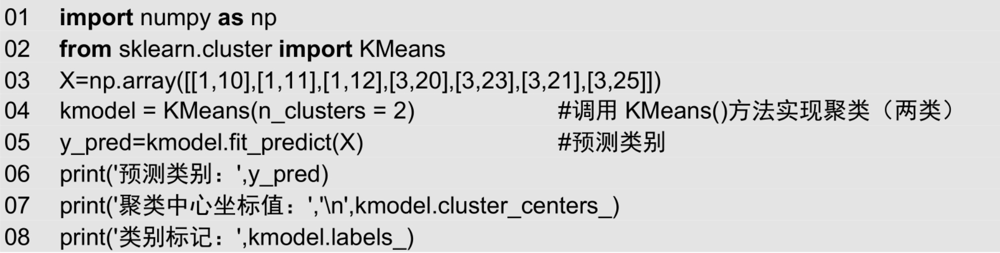

运行程序，输出结果如下：

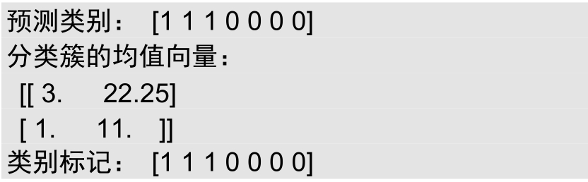

### 1.7.4　聚类数据生成器

1.7.3节列举了一个简单的聚类示例，但是聚类效果并不明显。本节生成了专门的聚类算法的测试数据，可以更好地诠释聚类算法，展示聚类效果。

Scikit-Learn的make_blobs()方法用于生成聚类算法的测试数据，直观地说，make_blobs()方法可以根据用户指定的特征数量、中心点数量、范围等生成几类数据，这些数据可用于测试聚类算法的效果。

make_blobs()方法的语法如下：

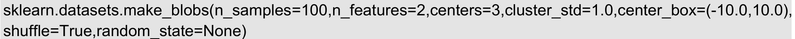

常用参数说明：　

n_samples：待生成的样本的总数。　

n_features：每个样本的特征数。　

centers：类别数。　

cluster_std：每个类别的方差，例如，生成两类数据，其中一类比另一类具有更大的方差，可以将cluster_std设置为[1.0,3.0]。

【示例05】　生成用于聚类的测试数据。（示例位置：资源包\MR\Code\10\05）
生成用于聚类的数据（500个样本，每个样本有两个特征），程序代码如下：

01  from sklearn.datasets import make_blobs

02  from matplotlib import pyplot
03  x,y = make_blobs(n_samples=500, n_features=2, centers=3)

接下来，通过KMeans()方法对测试数据进行聚类，程序代码如下：

01  from sklearn.cluster import KMeans
02  y_pred = KMeans(n_clusters=4, random_state=9).fit_predict(x)
03  plt.scatter(x[:, 0], x[:, 1], c=y_pred)
04  plt.show()
运行程序，效果如图10.5所示。

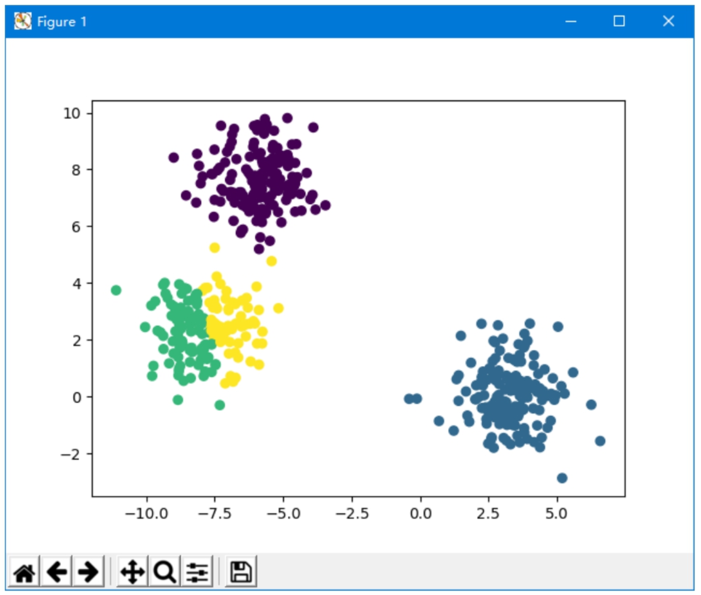

​                                                                                         图10.5　聚类散点图
从分析结果得知：相似的数据聚在一起，分成了4堆，也就是4类，并以不同的颜色显示，看上去清晰直观。

## 项目一：线性回归器

假设有一个数据文件data_singlevar.txt，文件里用逗号分隔符分割字段，第一个字段是输入值，第二个字段是与逗号前面的输入值相对应的输出值。建立一个线性回归模型，并检验模型的准确度。

（1）读取数据，其中x是数据，y是标记

import sys

import numpy as np

filename = 'data_singlevar.txt'

#filename = sys.argv[1]

X = []
y = []
with open(filename, 'r') as f:
    for line in f.readlines():
        xt, yt = [float(i) for i in line.split(',')]
        X.append(xt)
        y.append(yt)

（2）建立机器学习模型，需要用一种方法来验证模型，检查模型是否达到一定的满意度。为了实现这个方法，通常将数据分成两组：训练数据集（training dataset）和测试数据集（testing dataset）。训练数据集用来建立模型，测试数据集用来验证模型对未知数据的学习效果。因此先把数据分成训练数据与测试数据集：

#Train/test split

num_training = int(0.8 * len(X))
num_test = len(X) - num_training

#训练数据

X_train = np.array(X[:num_training]).reshape((num_training,1))
y_train = np.array(y[:num_training])

#测试数据

X_test = np.array(X[num_training:]).reshape((num_test,1))
y_test = np.array(y[num_training:])

（3）创建一个回归器对象

#Create linear regression object

from sklearn import linear_model

linear_regressor = linear_model.LinearRegression()

（4）利用训练数据集训练线性回归器，向fit方法提供输入数据即可训练模型。画图看是否拟合；

#Train the model using the training sets

linear_regressor.fit(X_train, y_train)

#Predict the output

y_test_pred = linear_regressor.predict(X_test)

#Plot outputs

import matplotlib.pyplot as plt

plt.scatter(X_test, y_test, color='green')
plt.plot(X_test, y_test_pred, color='black', linewidth=4)
plt.xticks(())
plt.yticks(())
plt.show()

（5）查看模型的准确性

#Measure performance

import sklearn.metrics as sm

print ("Mean absolute error =", round(sm.mean_absolute_error(y_test, y_test_pred), 2) )
print ("Mean squared error =", round(sm.mean_squared_error(y_test, y_test_pred), 2) )
print ("Median absolute error =", round(sm.median_absolute_error(y_test, y_test_pred), 2) )
print ("Explain variance score =", round(sm.explained_variance_score(y_test, y_test_pred), 2) )
print ("R2 score =", round(sm.r2_score(y_test, y_test_pred), 2))

评价指标：

平均绝对误差（mean absolute error）：绝对误差的平均值

均方误差（mean squared error):所有数据点的误差的平方的均值。

中位数绝对误差（median absolute error）：给定数据集的所有数据点的误差的中位数。这个指标的主要优点是可以消除异常值（outlier）的干扰。测试数据集中的单个坏点不会影响这个误差指标，均值误差会受到异常点的影响。

解释方差（explained variance score)：这个分数用于衡量我们的模型对数据集波动的解释能力。如果得分1.0分，那么表明我们的模型是完美的。

R方得分（R2 score)：这个指标读作“R方”，是指确定性相关系数。用于衡量模型对未知样本预测的效果。最好的得分是1.0。值也可以是复数。

（6）**保存模型**，下次使用时直接加载

#Model persistence

import pickle

output_model_file = 'D:\3_model_linear_regr.pkl'

with open(output_model_file, 'wb') as f:
    pickle.dump(linear_regressor, f)

with open(output_model_file, 'rb') as f:
    model_linregr = pickle.load(f)

y_test_pred_new = model_linregr.predict(X_test)
#print("\nNew mean absolute error =", round(sm.mean_absolute_error(y_test, y_test_pred_new), 2) ) 

## 项目二　二手房房价分析与预测

衣食住行，住房一直以来都是热门话题，而房价更是大家时刻关心的问题。虽然新商品房听着上档次，但是二手房是现房交易，并且具有地段较好、配套设施完善、产权权属清晰、选择面更广等优势，使得二手房越来越受到广大消费者的青睐。由此，越来越多的人关注二手房，对房价、面积、地理位置、装修程度等进行多维度对比与分析，从而找到既适合自己又具备一定升值空间的房子。

## 2.1　概述

随着现代科技化的不断进步，信息化将是科技发展中的重要元素之一，而人们每天都要面对海量的数据，如医疗数据、人口数据、人均收入等，因此数据分析将会得到广泛应用。数据分析在实际应用时可以帮助人们在海量数据中找到具有决策意义的重要信息。
本章将通过数据分析方法实现“二手房数据分析预测系统”，用于对二手房数据进行分析、统计，并根据数据中的重要特征实现房屋价格的预测，最后通过可视化图表方式进行数据的显示功能。

## 2.2　项目效果预览

在二手房数据分析预测系统中，查看二手房各种数据分析图表时，需要在主窗体工具栏中单击对应的工具栏按钮。主窗体运行效果如图13.1所示。

​                                                                                                图13.1　主窗体
在主窗体工具栏中单击“各区二手房均价分析”按钮，显示各区域二手房均价，如图13.2所示。

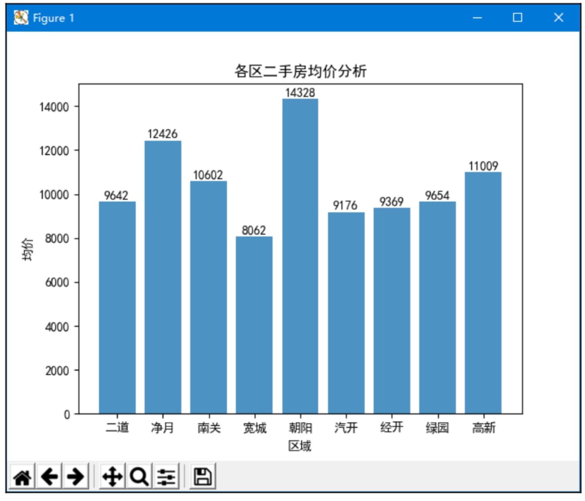

​                                                                                                    图13.2　各区二手房均价分析
在主窗体工具栏中单击“各区二手房数量所占比例”按钮，了解城市所属区域二手房的销售数量和占比情况，如图13.3所示。
经过分析得知：二手房数据中房子的装修程度也是购买者关心的一个重要元素。在主窗体工具栏中单击“全市二手房装修程度分析”按钮，分析全市二手房装修程度，如图13.4所示。

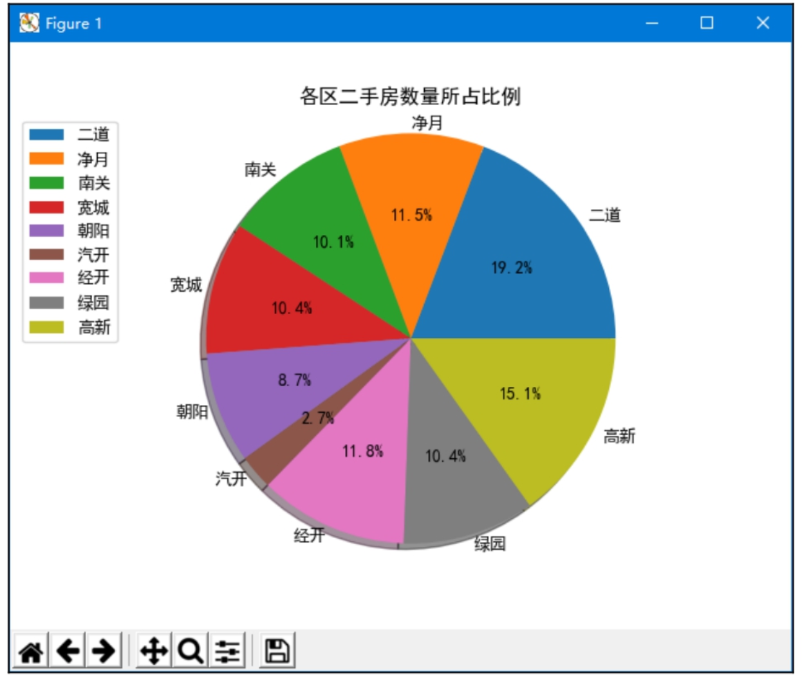

​                                                                              图13.3　各区二手房数量所占比例

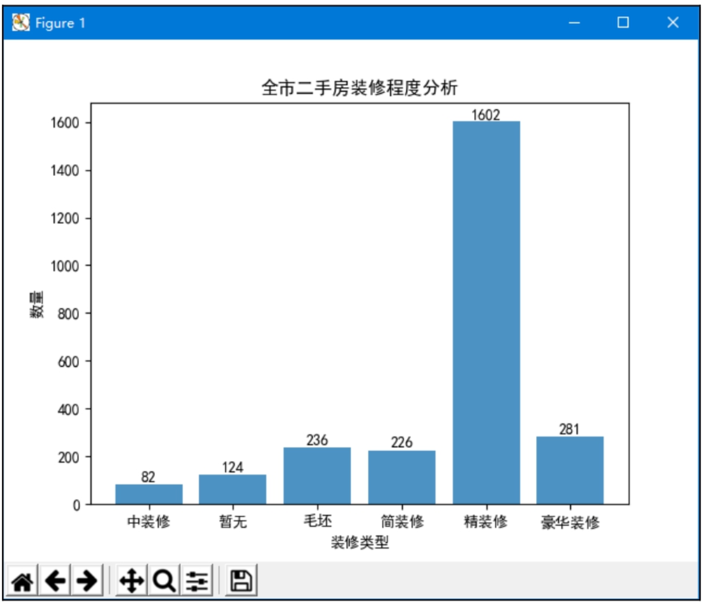

​                                                                                           图13.4　全市二手房装修程度分析
二手房的户型类别很多，如果需要查看所有二手房户型中比较热门的户型均价时，则在主窗体工具栏中单击“热门户型均价分析”按钮，分析热门户型均价，如图13.5所示。
分析二手房数据时，首先分析特征数据，然后通过回归算法的函数预测二手房的售价。在主窗体工具栏中单击“二手房售价预测”按钮，显示二手房售价预测的折线图，如图13.6所示。

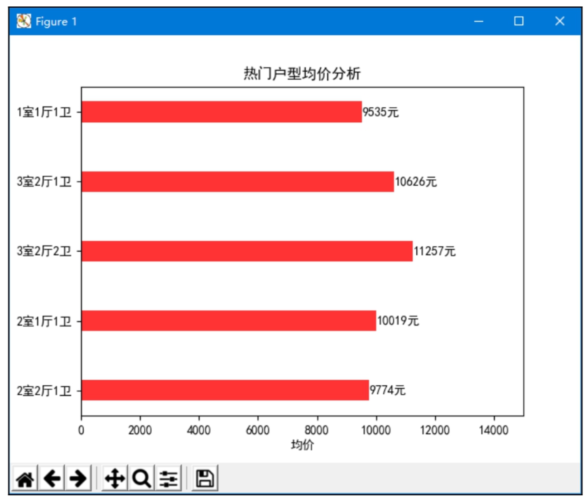

​                                                                                          图13.5　热门户型均价分析

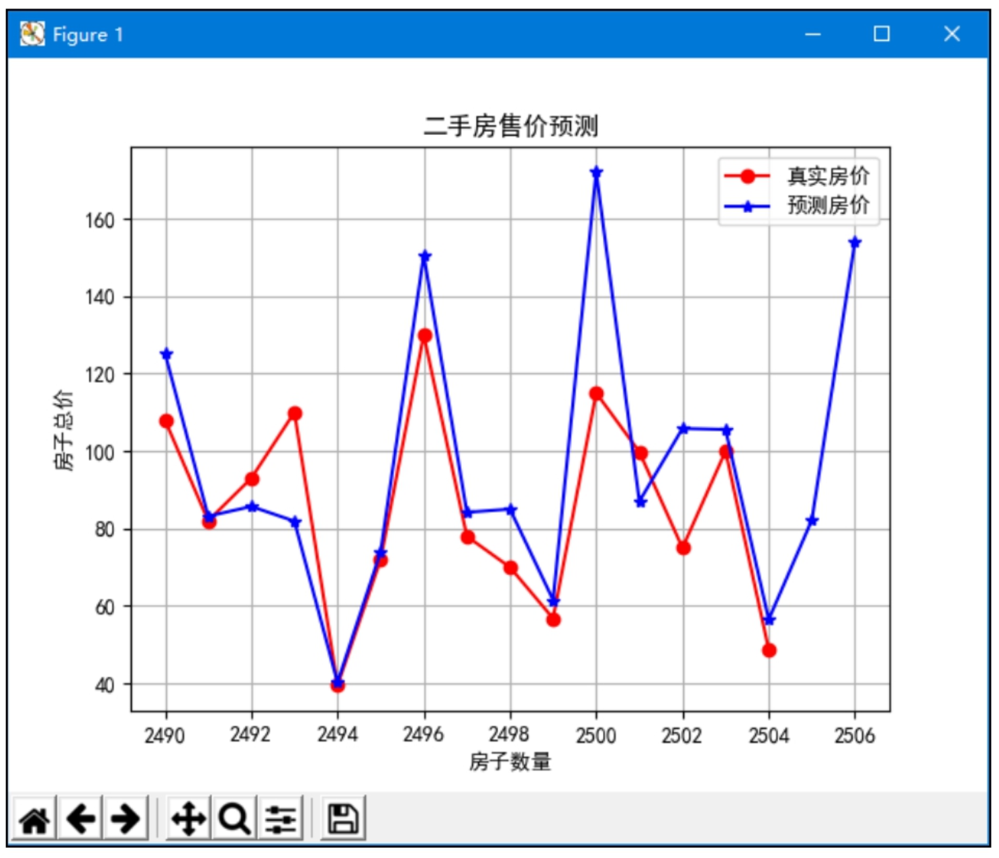

​                                                                                                            图13.6　二手房售价预测

## 2.3　项目准备

本项目的开发及运行环境如下。　

操作系统：Windows 7、Windows 10。　

语言：Python 3.7。　

开发环境：PyCharm。　

内置模块：sys。　

第三方模块：PyQt5（5.11.3）、PyQt5-tools（5.11.3.1.4）、Pandas（1.0.3）、xlrd（1.2.0）、xlwt（1.3.0）、Scipy（1.2.1）、NumPy（1.16.1）、Matplotlib（3.0.2）、Scikit-Learn（0.21.2）。

## 2.4　图表工具模块

图表工具模块为自定义工具模块，该模块中主要定义用于显示可视化数据图表的函数，用于实现饼形图、折线图以及条形图的绘制与显示工作。图表工具模块创建完成后根据数据分析的类型调用对应的图表函数，就可以实现数据的可视化操作。

### 2.4.1　绘制饼形图

在实现绘制饼形图时，首先需要创建chart.py文件，该文件为图表工具的自定义模块。然后在该文件中导入matplotlib模块与pyplot子模块。接下来为了避免中文乱码，需要使用rcParams变量。
绘制饼形图的函数名称为pie_chart()，用于显示各区二手房数量所占比例。pie_chart()函数需要以下3个参数：size为饼形图中每个区二手房数量；label为每个区对应的名称；title为图表的标题。
程序代码如下：（源码位置：资源包\MR\Code\13\house_data_analysis\chart.py）

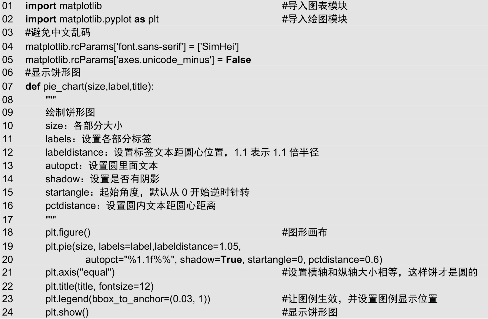

### 2.4.2　绘制折线图

绘制折线图的函数名称为broken_line()，用于显示真实房价与预测房价的折线图。该函数需要以下3个参数：y为二手房的真实价格；y_pred为二手房的预测价格；title为图表的标题。
程序代码如下：（源码位置：资源包\MR\Code\13\house_data_analysis\chart.py）

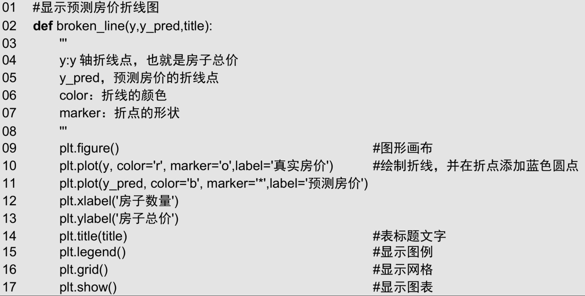

### 2.4.3　绘制条形图

绘制条形图的函数一共分为3个，分别用于显示各区二手房均价、全市二手房装修程度以及热门户型均价。下面介绍定义函数的具体方式。
1．绘制各区二手房均价的条形图
绘制各区二手房均价的条形图为纵向条形图，函数名称为average_price_bar()，该函数需要以下3个参数：x为全市中各区域的数据；y为各区域的均价数据；title为图表的标题。
程序代码如下：（源码位置：资源包\MR\Code\13\house_data_analysis\chart.py）

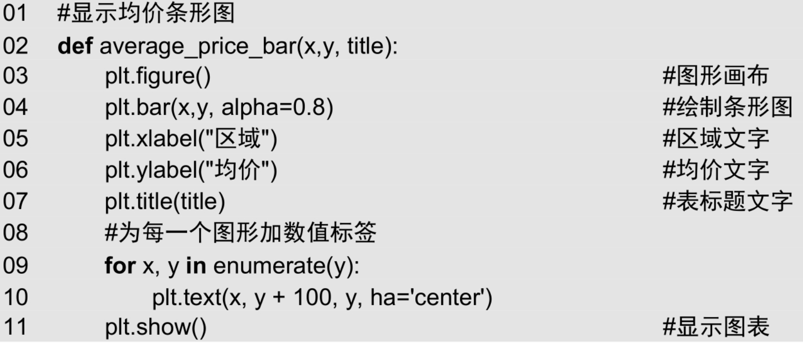

2．绘制全市二手房装修程度的条形图
绘制全市二手房装修程度的条形图为纵向条形图，函数名称为renovation_bar()，该函数需要以下3个参数：x为装修类型的数据；y为每种装修类型所对应的数量；title为图表的标题。
程序代码如下：（源码位置：资源包\MR\Code\13\house_data_analysis\chart.py）

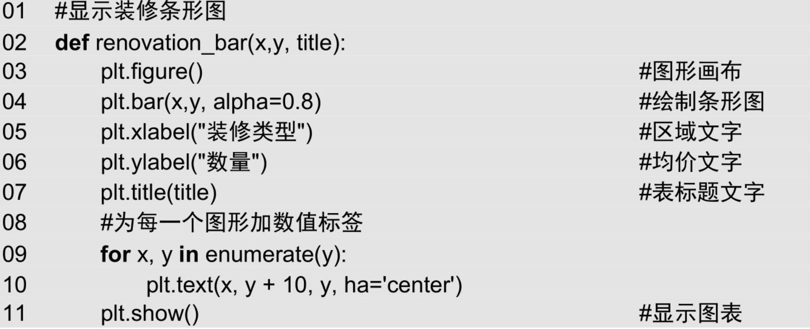

3．绘制热门户型均价的条形图
绘制热门户型均价的条形图为水平条形图，函数名称为bar()，该函数需要以下3个参数：price为热门户型的均价；type为热门户型的名称；title为图表的标题。
程序代码如下：（源码位置：资源包\MR\Code\13\house_data_analysis\chart.py）

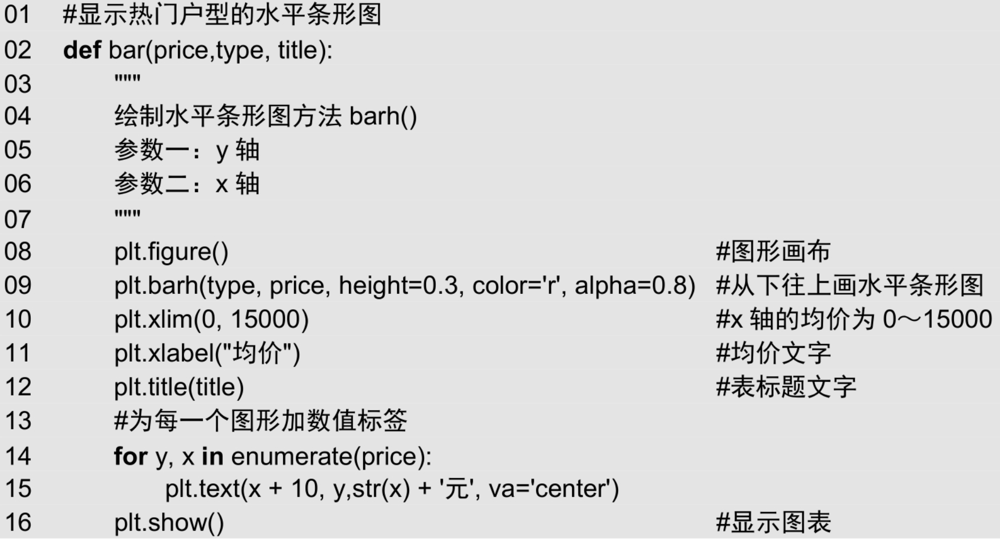

## 2.5　项目实现过程

### 2.5.1　数据清洗

在实现数据分析前需要先对数据进行清洗工作，清洗数据的主要目的是为了减小数据分析的误差。清洗数据时首先需要读取数据，然后观察数据中是否存在无用值、空值以及数据类型是否需要进行转换等。清洗二手房数据的具体步骤如下所示。
（1）读取二手房数据文件，显示部分数据。
程序代码如下：（源码位置：资源包\MR\Code\13\house_data_analysis\house_analysis.py）

01  import pandas as as pd                 #导入数据统计模块
02  data = pd.read_csv('data.csv')          #读取csv数据文件
03  print(data.head())                      #打印文件内容的头部信息
运行程序，输出结果如图13.7所示。

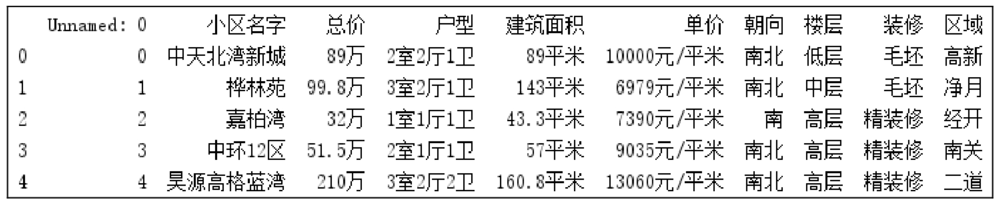

​                                                                                  图13.7　二手房数据（部分数据）
观察上述数据，首先“Unnamed: 0”索引列对于数据分析没有任何帮助，然后“总价”“建筑面积”“单价”列所对应的数据不是数值类型，所以无法进行计算。接下来对这些数据进行处理。
（2）将索引列“Unnamed: 0”删除；然后将数据中的所有空值删除；最后分别将“总价”“建筑面积”“单价”列所对应数据中的字符删除仅保留数字部分，再将数字转换为float类型，再次输出数据。
程序代码如下：（源码位置：资源包\MR\Code\13\house_data_analysis\house_analysis.py）

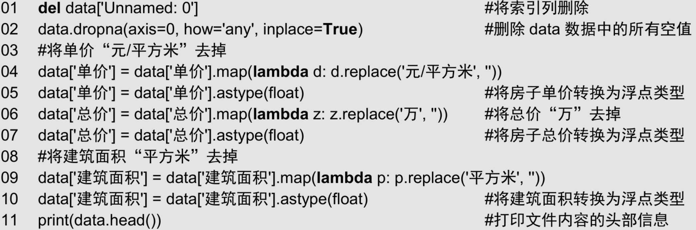运行程序，输出结果如图13.8所示。

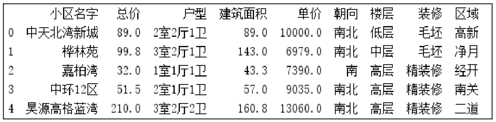

​                                                                           图13.8　处理后的二手房数据（部分数据）

### 2.5.2　区域二手房均价分析

实现区域二手房均价分析前，首先需要将数据按所属区域进行划分，然后计算每个区域的二手房均价，最后将区域及对应的房屋均价信息通过纵向条形图显示，具体步骤如下所示。
（1）通过groupby()方法实现二手房区域的划分，然后通过mean()方法计算出每个区域的二手房均价，最后分别通过index属性与values属性获取所有区域信息与对应的均价。
程序代码如下：（源码位置：资源包\MR\Code\13\house_data_analysis\house_analysis.py）

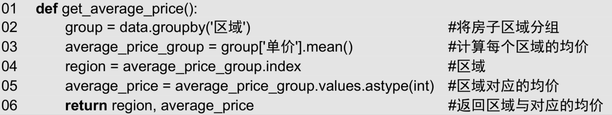

（2）在主窗体初始化类中创建show_average_price()方法，用于绘制并显示各区二手房均价分析图。程序代码如下：（源码位置：资源包\MR\Code\13\house_data_analysis\show_window.py）

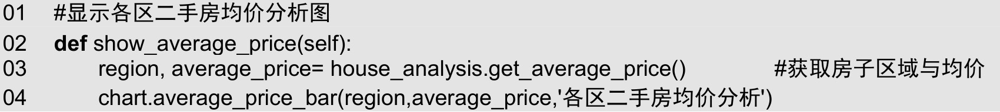

（3）指定显示各区二手房均价分析图，按钮事件所对应的方法。
程序代码如下：（源码位置：资源包\MR\Code\13\house_data_analysis\show_window.py）

01 #显示各区二手房均价分析图，按钮事件
02 main.btn_1.triggered.connect(main.show_average_price)

（4）在主窗体工具栏中单击“各区二手房均价分析”按钮，显示各区二手房均价分析图，如图13.9所示。

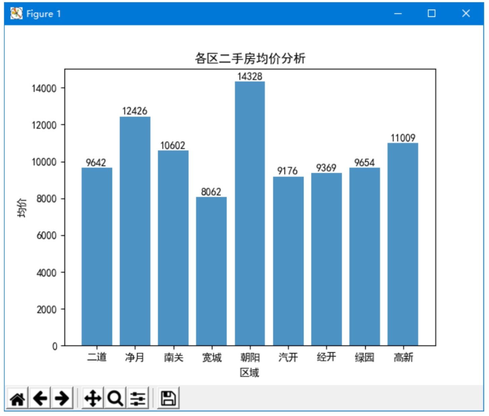

​                                                                             图13.9　各区二手房均价分析图

### 2.5.3　区域二手房数据及占比分析

在实现各区房子数量比例时，首先需要将数据中每个区域进行分组并获取每个区域的房子数量，然后获取每个区域与对应的二手房数量，最后计算每个区域二手房数量的百分比。具体步骤如下所示。
（1）通过groupby()方法对房子区域进行分组，并使用size()方法获取每个区域的分组数量（区域对应的房子数量），然后使用index属性与values属性分别获取每个区域与对应的二手房数量，最后计算每个区域房子数量的百分比。
程序代码如下：（源码位置：资源包\MR\Code\13\house_data_analysis\house_analysis.py）

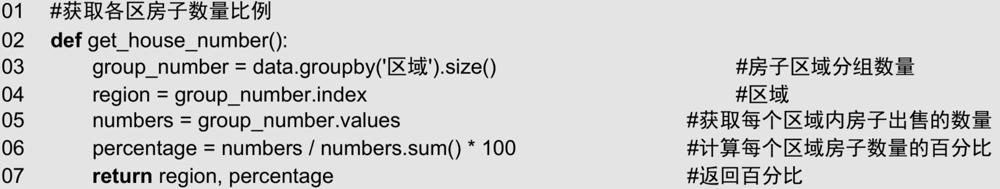

（2）在主窗体初始化类中创建show_house_number()方法，用于绘制并显示各区二手房数量所占比例的分析图。
程序代码如下：（源码位置：资源包\MR\Code\13\house_data_analysis\show_window.py）

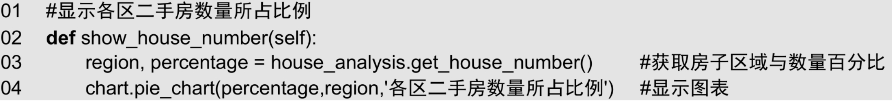

（3）指定显示各区二手房数量所占比例图，按钮事件所对应的方法。
程序代码如下：（源码位置：资源包\MR\Code\13\house_data_analysis\show_window.py）

01 #显示各区二手房数量所占比例图，按钮事件
02 main.btn_2.triggered.connect(main.show_house_number)
（4）在主窗体工具栏中单击“各区二手房数量所占比例”按钮，显示各区二手房数量及占比分析图，如图13.10所示。

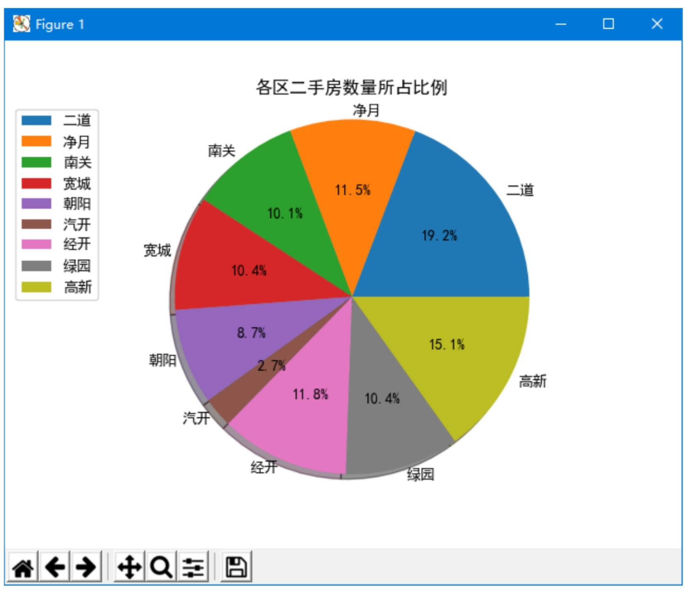

​                                                                          图13.10　各区二手房数量所占比例分析图

### 2.5.4　全市二手房装修程度分析

在实现全市二手房装修程度分析时，首先需要将二手房的装修程度进行分组并将每个分组对应的数量统计出来，再将装修程度分类信息与对应的数量进行数据的分离工作，具体步骤如下所示。
（1）通过groupby()方法对房子的装修程度进行分组，并使用size()方法获取每个装修程度分组的数量，然后使用index属性与values属性分别获取每个装修程度分组与对应的数量。
程序代码如下：（源码位置：资源包\MR\Code\13\house_data_analysis\house_analysis.py）

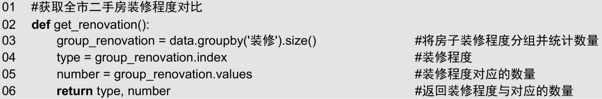

（2）在主窗体初始化类中创建show_renovation()方法，用于绘制并显示全市房子装修程度的分析图。
程序代码如下：（源码位置：资源包\MR\Code\13\house_data_analysis\show_window.py）

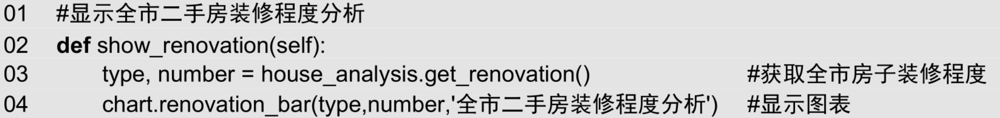

（3）指定显示全市二手房装修程度分析图，按钮事件所对应的方法。
程序代码如下：（源码位置：资源包\MR\Code\13\house_data_analysis\show_window.py）

01 #显示全市二手房装修程度分析图，按钮事件
02 main.btn_3.triggered.connect(main.show_renovation)
（4）在主窗体工具栏中单击“全市二手房装修程度分析”按钮，显示全市二手房装修程度分析图，如图13.11所示。

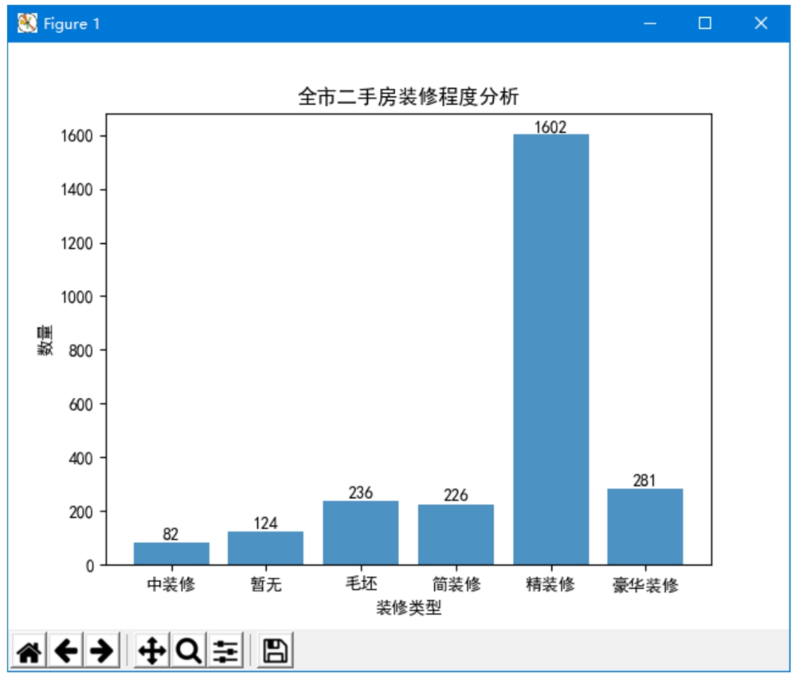

​                                                                      图13.11　全市二手房装修程度分析图

### 2.5.5　热门户型均价分析

在实现热门户型均价分析时，首先需要将户型进行分组并获取每个分组所对应的数量，然后对户型分组数量进行降序处理，提取前5组户型数据，作为热门户型的数据，最后计算每个户型的均价。具体步骤如下所示。
（1）通过groupby()方法对房子的户型进行分组，并使用size()方法获取每个户型分组的数量，使用sort_values()方法对户型分组数量进行降序处理。然后通过head(5)方法，提取前5组户型数据。再通过mean()方法计算每个户型的均价，最后使用index属性与values属性分别获取户型与对应的均价。
程序代码如下：（源码位置：资源包\MR\Code\13\house_data_analysis\house_analysis.py）

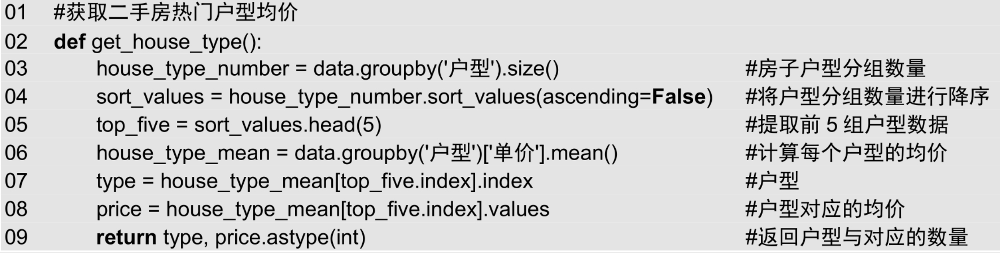

（2）在主窗体初始化类中创建show_type()方法，绘制并显示热门户型均价的分析图。
程序代码如下：（源码位置：资源包\MR\Code\13\house_data_analysis\show_window.py）

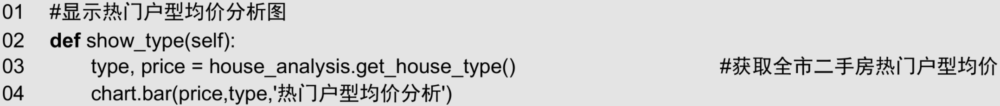

（3）指定显示热门户型均价分析图，按钮事件所对应的方法。
程序代码如下：（源码位置：资源包\MR\Code\13\house_data_analysis\show_window.py）

01 #显示热门户型均价分析图，按钮事件
02 main.btn_4.triggered.connect(main.show_type)
（4）在主窗体工具栏中单击“热门户型均价分析”按钮，显示热门户型均价分析图，效果如图13.12所示。

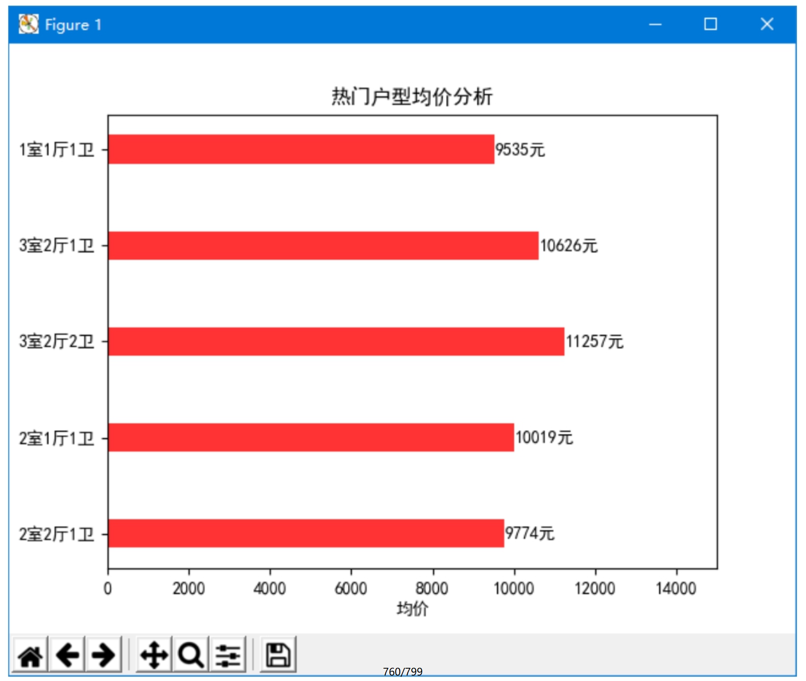

​                                                                                    图13.12　热门户型均价分析图

### 2.5.6　二手房房价预测

在实现二手房房价预测时，需要提供二手房源数据中的参考数据（特征值），这里将“户型”和“建筑面积”作为参考数据来进行房价的预测，所以需要观察“户型”数据是否符合分析条件。如果参考数据不符合分析条件，则需要再次对数据进行清洗处理。再通过源数据中已知的参考数据“户型”和“建筑面积”进行未知房价的预测。实现的具体步骤如下所示。
（1）查看源数据中“户型”和“建筑面积”数据，确认数据是否符合数据分析条件。
程序代码如下：（源码位置：资源包\MR\Code\13\house_data_analysis\house_analysis.py）

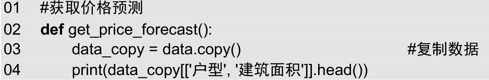

运行程序，输出结果如图13.13所示。

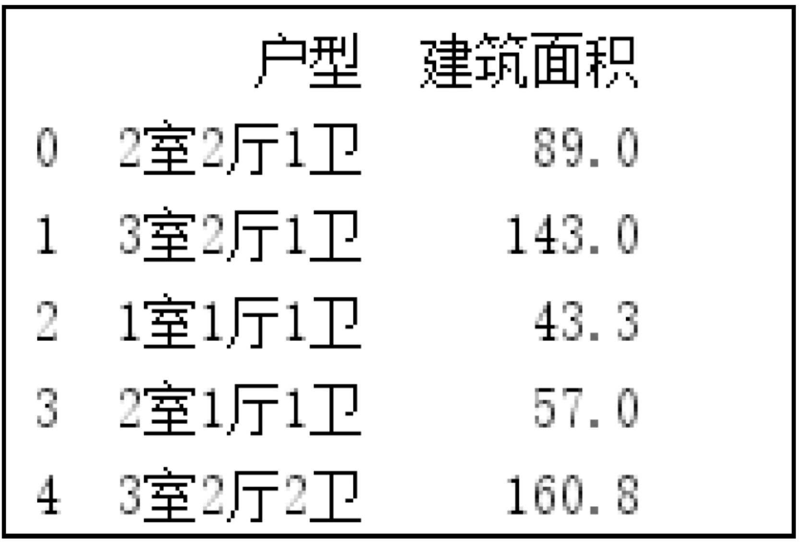

​                                                             图13.13　户型和建筑面积（部分数据）
（2）从输出结果得知：“户型”数据中包含文字信息，而文字信息并不能实现数据分析时的拟合工作，所以需要将“室”“厅”“卫”进行独立字段的处理。
程序代码如下：（源码位置：资源包\MR\Code\13\house_data_analysis\house_analysis.py）

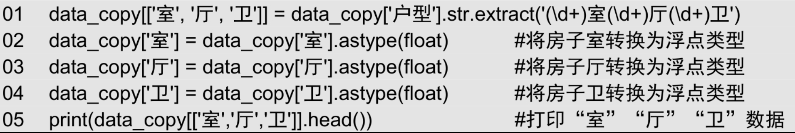

运行程序，输出结果如图13.14所示。

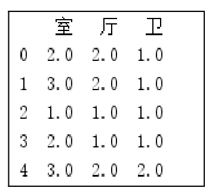

​                                                                           图13.14　处理后的户型数据（部分数据）
（3）将数据中没有参考意义的数据删除，其中包含“小区名字”“户型”“朝向”“楼层”“装修”“区域”“单价”“空值”，然后将“建筑面积”小于300平方米的房子信息筛选出来。
程序代码如下：（源码位置：资源包\MR\Code\13\house_data_analysis\house_analysis.py）

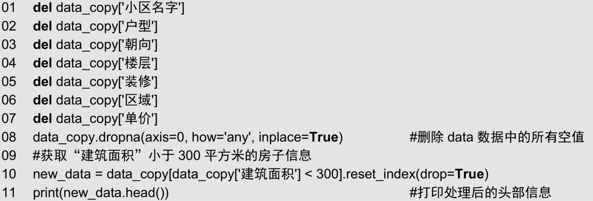

运行程序，输出结果如图13.15所示。

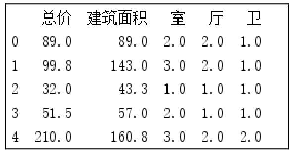

​                                                            图13.15　“建筑面积”小于300平米的数据（部分数据）
（4）添加自定义预测数据，其中包含“总价”“建筑面积”“室”“厅”“卫”，总价数据为None，其他数据为模拟数据。然后进行数据的标准化，定义特征数据与目标数据，最后训练回归模型进行未知房价的预测。
程序代码如下：（源码位置：资源包\MR\Code\13\house_data_analysis\house_analysis.py）

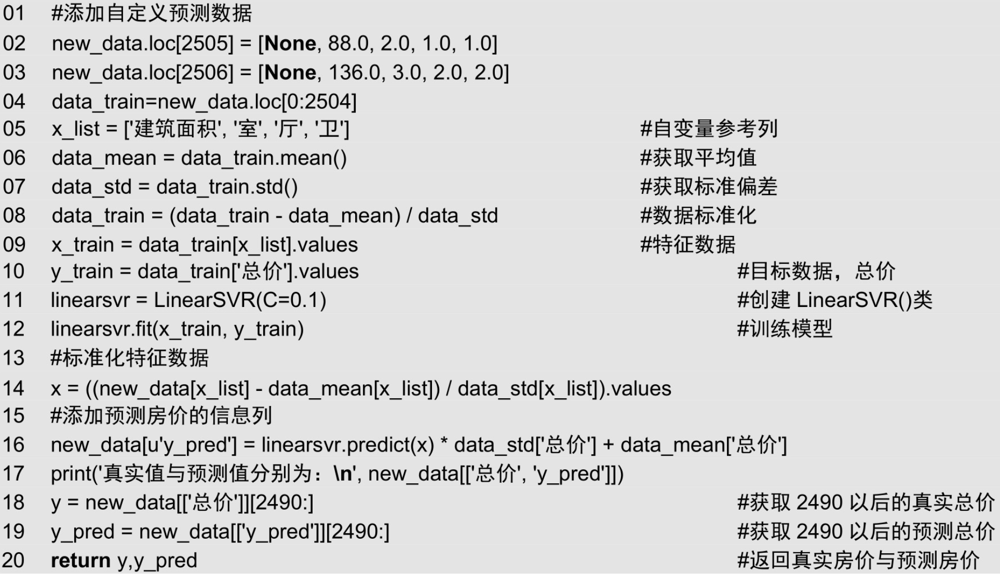

查看打印的“真实值”和“预测值”，其中索引编号

2505和2506均为添加自定义的预测数据，输出结果如图13.16所示。（由于数据过多，省略部分数据）

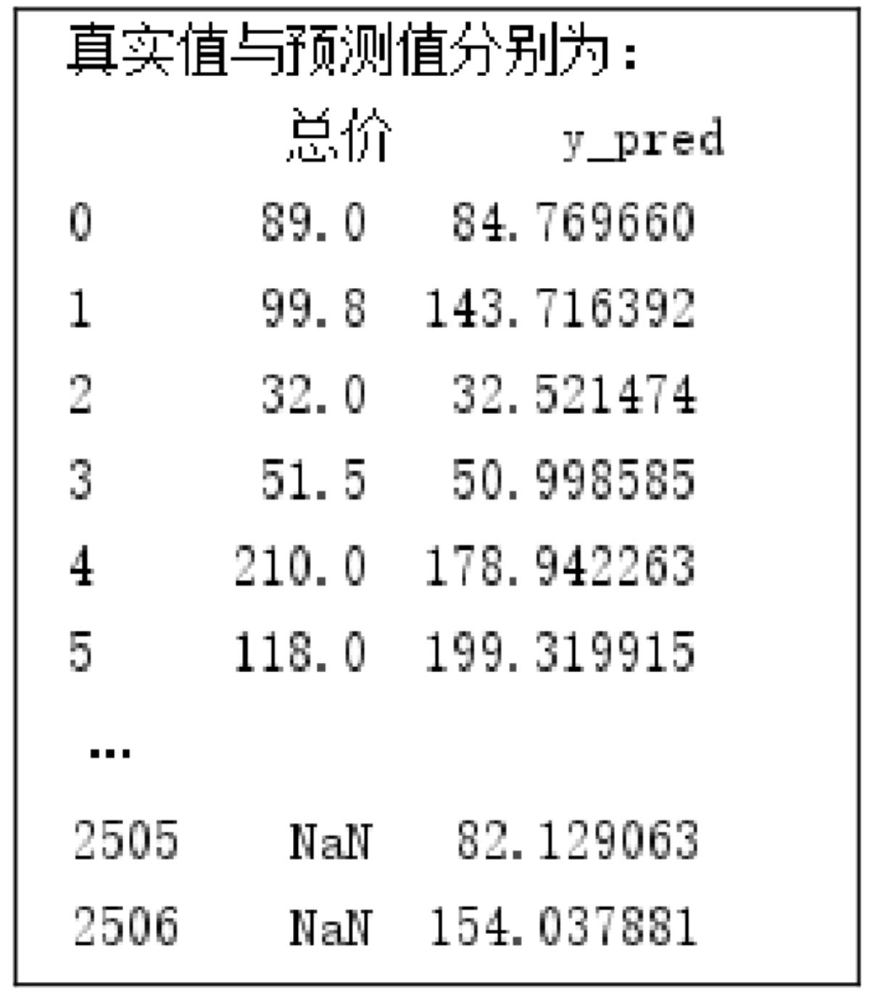

​                                                                 图13.16　真实值和预测值（省略部分数据）
从输出结果得知：“总价”一列为房价的真实数据，而“y_pred”一列为房价的预测数据，其中索引为2505和2506为模拟的未知数据，所以“总价”列中的数据为空，而右侧的数据是根据已知的参考数据预测而来的。
（5）在主窗体初始化类中创建show_total_price()方法，用于绘制并显示二手房售价预测折线图。
程序代码如下：（源码位置：资源包\MR\Code\13\house_data_analysis\show_window.py）

01  def show_total_price(self):
02             true_price,forecast_price = house_analysis.get_price_forecast()   #获取预测房价
03             chart.broken_line(true_price,forecast_price,'二手房售价预测')     #绘制及显示图表
（6）指定显示全市二手房户售价预测图，按钮事件所对应的方法。
程序代码如下：（源码位置：资源包\MR\Code\13\house_data_analysis\show_window.py）

01 #显示全市二手房户售价预测图，按钮事件
02 main.btn_5.triggered.connect(main.show_total_price)
（7）在主窗体工具栏中单击“二手房售价预测”按钮，显示全市二手房房价预测分析图，效果如图13.17所示。

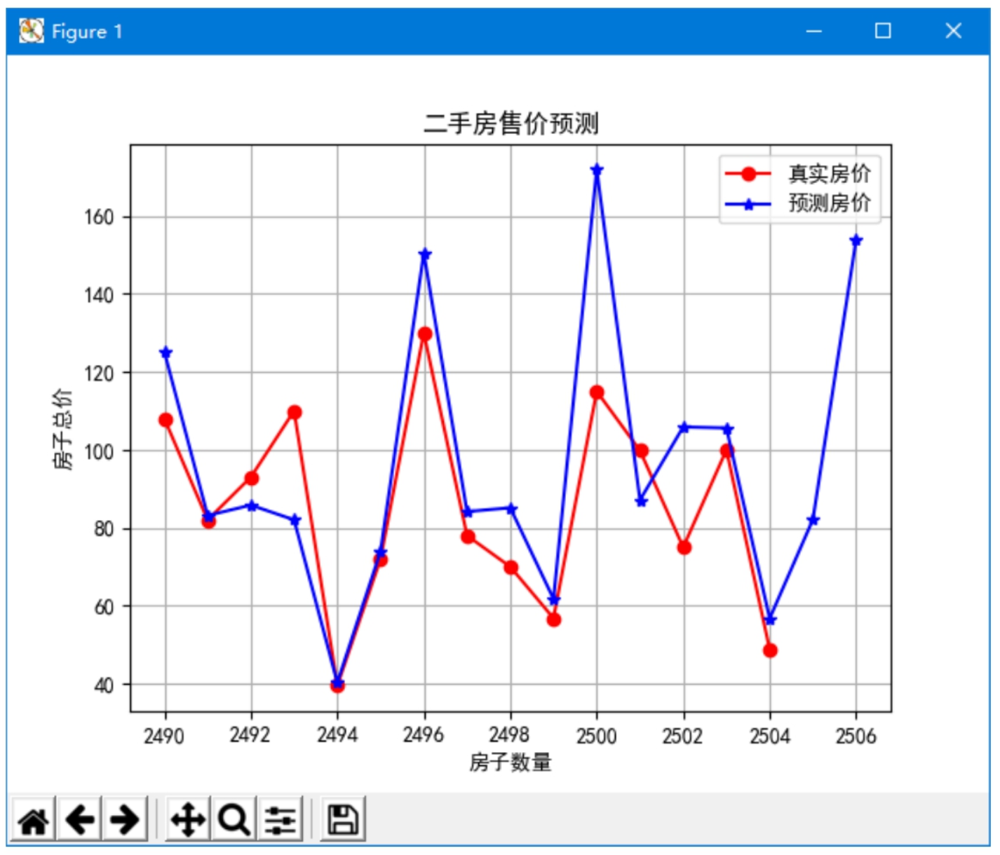

​                                                                     图13.17　全市二手房房价预测折线图

说明
为了清晰地体现二手房房价预测数据，以上选择了展示部分数据，即索引为2490以后的预测房价，其中预测房价多出的部分为索引2505和2506的预测房价。

## 2.6　小结

本章主要使用Python开发了二手房房价分析与预测系统，该项目主要应用了Pandas和Scikit-Learn模块。其中Pandas模块主要用于实现数据的预处理以及数据的分类等，而Scikit-Learn模块主要用于实现数据的回归模型以及预测功能，最后通过绘图模块Matplotlib，将分析后的数据绘制成图表，从而形成更直观的可视化数据。在开发中，数据分析是该项目的重点与难点，需要读者认真领会其中的算法，方便读者开发其他项目。
